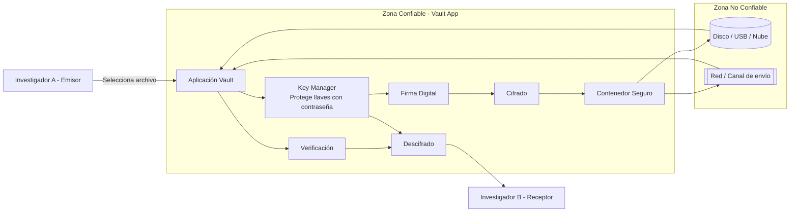

# 🔬 Secure Digital Document Vault - Laboratorio

## 1. System Overview (Descripción General)

En un entorno de laboratorio, los resultados de experimentos y bitácoras de investigación son activos críticos que deben protegerse contra el acceso no autorizado y la manipulación accidental o malintencionada. Este sistema resuelve esto proporcionando un contenedor seguro para estos documentos.

### Funcionalidades principales

- **Cifrado de archivos:** Solo el destinatario puede leer el contenido.
- **Firmas digitales:** Permiten verificar el autor y detectar modificaciones.
- **Gestión de llaves:** Las llaves privadas se protegen con contraseña.
- **Intercambio seguro:** Un archivo puede compartirse con múltiples destinatarios.

### Fuera de alcance

- Seguridad física del equipo
- Recuperación de contraseña olvidada
- Seguridad de la red (firewalls o detección de intrusos).

---

## 2. Architecture Diagram (Diagrama de Arquitectura)

El siguiente diagrama muestra los componentes, límites de confianza y flujo principal del sistema.

---

## 3. Requerimientos de seguridad
El sistema debe cumplir con propiedades específicas para garantizar la validez científica de los documentos:

1. Confidencialidad de los archivos: Un atacante que obtenga el contenedor cifrado no debe poder leer el contenido de los resultados de los experimentos sin la llave privada correcta.

2. Integridad del contenido: El sistema debe detectar si un reporte de laboratorio ha sido modificado, aunque sea por un solo bit, después de ser guardado.

3. Autenticidad del investigador: Debe ser posible verificar que un resultado fue generado por un científico específico y no por un tercero suplantando su identidad. Ademas de verificar que la decriptacino debe ser por personal autorizado

4. Protección de llaves privadas: Las llaves que permiten el acceso al baúl nunca deben almacenarse en texto plano y deben estar protegidas contra intentos de adivinanza.
